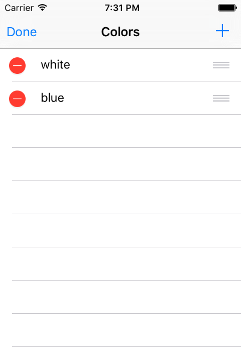

# Color Board

> An iOS App Project learn from 《iOS Programming - The Big Nerd Ranch Guide》 4ed

almost full function

- add color
- delete color
- reorder color
- multi language
- state restoration

